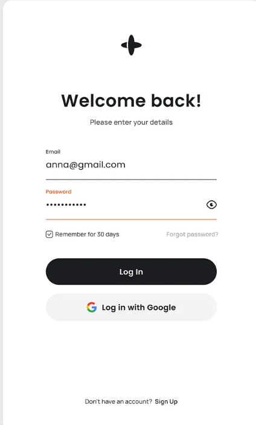

## insuranceAPP
### 技术栈
- 前端：Flutter(三端互通：IOS、Android、Web统一开发)
- 后端：python FastAPI
- 数据库：PostgreSQL
- 部署：Docker
- 包管理工具：uv

### 项目结构
```
insuranceApp/
├── backend/         # FastAPI后端服务
│   ├── app/         # 应用代码
│   │   ├── api/     # API路由
│   │   ├── core/    # 核心配置
│   │   ├── db/      # 数据库
│   │   ├── models/  # 数据模型
│   │   └── schemas/ # 数据架构
│   ├── sql/         # 保险产品sql文件
│   │   ├── 表说明.md # 表说明，说明各个sql文件的内容和表格式
│   ├── tests/       # 测试
│   ├── Dockerfile   # Docker配置
│   ├── pyproject.toml # Python项目配置
│   └── requirements.txt # 依赖
└── frontend/        # Flutter前端
    ├── lib/         # 应用代码
    │   ├── models/  # 数据模型
    │   ├── screens/ # 屏幕页面
    │   ├── services/# 服务
    │   ├── utils/   # 工具类
    │   └── widgets/ # UI组件
    ├── assets/      # 资源文件
    └── pubspec.yaml # Flutter项目配置
```

### 前端页面设计
- **登录页**
    - 具体参考
    - 采用经典的基础页面设计
    - 顶部为logo,logo下方为账号、密码输入框；密码输入框有密码显示隐藏按钮
    - 输入框下方左侧有持久化勾选框，勾选后下次登录时无需再次输入账号密码
    - 输入框下方右侧有忘记密码按钮，点击转至忘记密码模式
        - 忘记密码模式包含logo、账号、新密码、重置密码按钮（暂时不添加验证信息）
    - 再下方为登录按钮（暂不支持通过其他方式登录）
    - 页面底部为没有账号时的注册按钮，点击转至注册模式
        - 注册模式同样包含logo、账号、密码、确认密码、注册按钮
        - 注册模式自动检测密码和确认密码是否一致，不一致时提示
    - 具有账号密码错误时的提示，输入框变为红色
    - 登录成功后转至首页
- **首页**
    - 首页可通过底部导航栏通过滑动或点击，切换聊天页面、保险页面、规划页面、个人信息页面；默认为对话页面

- **对话页面**
    - 对话页面的实现可以参考insuranceAPP/Financial-Planner项目的实现，转变为Flutter实现
        - Financial-Planner项目是基于typescript+react实现Dify前端项目，可以作为逻辑和结构参考
    - 对话页面由顶部栏、中间对话框、底部输入框组成
    - 如果是新对话
        - 此时对话框中展示该模块的基本信息，开场白、开场推荐问题列表、用户输入表单等
        - 可以通过DifyAPI:GET/parameters获取应用参数
    - 顶部栏包含当前对话标题（默认显示为“新对话”）、一个侧面按钮、一个新建对话按钮组成
        - 对话标题可以由用户重命名，该功能可以由Dify API:POST/conversations/:conversation_id/name实现
        - 需要注意的是，对话标题可以通过POST/conversations/:conversation_id/name中将auto_generate设置为true，由Dify API自动生成,也可以使用这个方法自动更新对话标题
        - 左上角一个菜单按钮，点击可以进入菜单页面
        - 右上角一个新建对话按钮可新建一个对话，并终止当前对话，重置聊天页面。
    - 中间对话框由经典的头像+对话气泡的方式组成
        - 气泡中的内容需要能够展示ai返回的markdown格式内容,并且支持流式地显示
            - 最好能够通过Dify对话消息API返回的workflow_started、node_started、node_finished、workflow_finished等事件，显示加载进度。
        - 需要能够展示用户上传的图片、文件信息等
        - 气泡应该有点赞、点踩、语音播放按钮
            - 点赞、点踩按钮可以由Dify API:POST/messages/:message_id/feedbacks实现
            - 语音播放可以通过Dify API:POST/text-to-audio实现
        - 需要能够通过滚动上滑加载历史消息：
            - 可以通过Dify API:GET/messages获取会话历史消息
    - 底部输入框包含输入框、一个语音输入按钮、一个上传文件按钮和一个发送按钮（在导航栏之上）。
        - 发送按钮通过调用Dify API:POST/chat-messages发送消息
        - 语音输入按钮通过调用Dify API:POST/audio-to-text实现
            - 语音输入按钮可采取长按按钮移至中心变为圆形开始录音，通过检测声音大小变动圆形的大小实现动画效果，实时转录的显示转录后的文字的实现方式
        - 上传文件按钮通过调用Dify API:POST/file-upload实现

- **菜单页面**
    - 菜单页面分为三个部分，纵向排列
    - 第一个部分为AI模块选择
        - 通过/ai_modules接口获取AI模块列表，
        - 然后使用获得的api key通过Dify API:GET/info获取应用信息(名称和描述)
        - 并通过横向卡片列表的方式展示ai模块的名称和描述。
    - 第二个部分为历史聊天记录
        - 通过纵向列表的方式展示历史聊天的名称和时间。
        - 可以通过dify API:GET/conversations获取会话历史列表
            - 需要注意的是，会话历史列表仅包含当前选择的AI模块的会话历史
            - 如果切换ai模块，会话历史列表也应该相应的切换！
        - 点击后可跳转至对应会话的对话页面继续聊天
        - 可以通过Dify API:DELETE/conversations/:conversation_id删除会话
    - 第三部分为右上角一个返回按钮，点击后可以返回对话页面

- **保险页面**
    - 保险产品页面分为三个部分，纵向排列
    - 第一部分为顶部导航栏
        - 通过GET /insurance_products/product_types获取保险产品类型列表，通过获取的列表设置顶部导航栏
        - 顶部导航栏用于切换保险产品种类（可以通过点击、滑动等方式切换）
        - 保险产品种类影响搜索时发送的product_type字段,进而影响后端搜索那个表
    - 第二部分为搜索栏
        - 搜索栏包含一个搜索框、一个搜索按钮、一个重置按钮以及一个下拉表单
        - 搜索框对应搜索的product_name字段
        - 下拉表单点击后显示一个大的表格，包含许多表项，每个表项对应每个保险产品种类的可选字段，可以进行筛选，也可以为空（每个保险产品不同）
            - 可以通过GET /insurance_products/product_fields获取保险产品类型对应字段列表
        - 搜索按钮和重置按钮分别对应搜索和重置，重置按钮清空搜索框和下拉表单
    - 第三部分为保险产品列表
        - 保险产品以卡片的形式展示，卡片包含产品名称、公司名称、保险类型、保费、总评分这些基本信息
        - 卡片右端有查看详情按钮，点击后转至具体保险产品信息页面
        - 卡片列表末尾有页码，可以通过点击页码或点击页码左右两端的切换页按钮来切换页，切换页会向后端请求对应页的保险产品列表
        - 卡片列表的右上角有排序按钮，用类似下拉表单的方式，点击后可以选择按照什么字段排序（会重新向后端请求数据）

- **具体保险产品信息页面**
    - 点击查看详情后进入，使用对应保险产品id通过GET /insurance_products/product_info获取具体保险产品信息
    - 根据不同的保险产品类型展示不同的信息，具体由~/insuranceApp/backend/sql/表说明.md中的表结构决定
    - 页面左上角需要包含一个返回按钮，点击后返回保险产品列表页面

- **个人中心页面**
    - 个人中心页面目前只需展示用户个人信息
    - ui风格与当前app的其他页面一致
    - 个人中心页面包含一个顶部栏，一个用户个人信息卡片
    - 点击用户个人信息卡片后，可以进入**用户个人信息编辑页面**
        - 用户个人信息编辑页面包含一个顶部栏，顶部栏左上角有一个返回按钮，用于返回个人中心页面
        - 进入用户个人中心页面后，通过GET /user_info获取用户个人信息
        - 将获取到的用户个人信息用合适的方式展示，个人信息格式具体可参考后端数据库中用户个人信息表的表结构
        - 展示ui风格与当前app的其他页面一致，可以适当使用卡片的形式
        - 用户可以通过直接点击对应字段进行编辑（点击后，字段变为输入框，用户可以输入内容）
            - 对于family_info中的family_members，可以点击添加或删除按钮，添加或删除一个家庭成员
            - 对于goal_info中的goals，可以点击添加或删除按钮，添加或删除一个目标
        - 用户个人信息编辑页面底部包含一个保存按钮，点击后，通过API POST /user_info更新用户个人信息

- **个人信息初始化页面**
    - 个人信息初始化页面仅在新用户成功注册后进入，用户正常登录或保持登录不会进入该页面
    - 个人信息初始化的功能是，用亲和性和引导性强的方式，引导新用户填写一些个人信息包括基本信息、财务信息和目标信息，来初始化用户个人信息表
    - 个人信息初始化页面设计
        - ui风格与登录页面类似，不需要填满整个页面，而是使用卡片的形式
        - 卡片包含一个logo，若干输入框，总共分为三页，卡片底部有页码显示和上下页切换按钮，最后一页末尾有提交按钮
        - 第一页包含基本信息输入框，包括年龄、性别、城市
        - 第二页包含财务信息输入框，包括职业、收入、支出、资产、负债
        - 第三页包含目标信息输入框，包括目标、目标详情
        - 每一页的logo下方，输入框上方需要包含恰当的提示语，提示语需要能够引导用户填写个人信息，以下提示语仅供参考，可以适当修改
            - 第一页的提示语为：欢迎来到skysail，请您提供一些您的基本信息如年龄和性别，这能帮助我们更好地了解您来为您提供服务，如您担心隐私泄露，也可以不进行填写
            - 第二页的提示语为：请您提供一些您的财务信息，您可以回忆您的工作状况、生活支出和目前拥有的资产和负债，进行填写，这能帮助我们更好地了解您的财务状况
            - 第三页的提示语为：您目前最关心的问题是什么？最想要达成的目标是什么？例如：存下100万元提前退休，或是为养老做准备，您可以填写这部分信息，我们能够根据您的目标为您提供更加个性化的服务
        - 以上字段均可以留空，留空则提交空值，即''。
        - 提交按钮点击后，通过API POST /user_info更新用户个人信息
        - 提交按钮点击后，转至个人中心页面
        

    
### 后端API
- 登录API
    - 请求方式：POST
    - 请求路径：/login
    - 请求参数：
        - account: 账号
        - password: 密码
    - 后端根据账号密码判断是否登录成功
    - 返回体：
        - code:状态码
        - token: JWT token
        - user_id: 用户ID
        - message: 登录成功或失败信息
    - 登录成功后，将token和user_id返回给前端
    - 登录失败后，返回错误信息
- 注册API
    - 请求方式：POST
    - 请求路径：/register
    - 请求参数：
        - account: 账号
        - password: 密码
    - 后端将账号和密码储存到数据库中,并使用账号为用户生成user_id
    - 返回体：
        - code:状态码
        - message: 注册成功或失败信息
        - token: JWT token
        - user_id: 用户ID
- 忘记密码API
    - 请求方式：POST
    - 请求路径：/reset_password
    - 请求参数：
        - account: 账号
        - new_password: 新密码
    - 后端根据账号和新密码更新数据库中密码
    - 返回体：
        - code:状态码
        - message: 重置密码成功或失败信息
        - token: JWT token
        - user_id: 用户ID

- 获取AI模块列表API
    - 请求方式：GET
    - 请求路径：/ai_modules
    - 请求参数：
        - user_id: 用户ID
    - 后端根据用户ID获取AI模块列表
    - 返回体：
        - code:状态码
        - message: 获取AI模块列表成功或失败信息
        - ai_modules: AI模块API key列表
    - AI key列表可以设置在.env文件中

- 对话和聊天相关的API
    - **请注意**：本后端不需要实现对话和聊天的API，前端直接调用Dify提供的API即可。


- 获取保险产品类型API
    - 请求方式：GET
    - 请求路径：/insurance_products/product_types
    - 请求参数：
    - 返回体：
        - code:状态码
        - message: 获取保险产品类型成功或失败信息
        - product_types: 保险产品类型列表（现在包含定期寿险、定额终身寿险、意外险、年金险、重疾险、高端医疗险、百万医疗险及中端医疗险）

- 获取保险产品类型对应字段API
    - 请求方式：GET
    - 请求路径：/insurance_products/product_fields
    - 请求参数：
        - product_type: 产品类型
    - 返回体：
        - code:状态码
        - message: 获取保险产品类型对应字段成功或失败信息
        - fields: 保险产品类型对应字段列表


- 保险产品搜索API
    - 请求方式：GET
    - 请求路径：/insurance_products/search
    - 请求参数：
        - product_type: 产品类型
        - page:页码
        - limit:每页条数
        - sort_by: 排序字段,默认按照total_score排序
        - 上面的字段为必填字段，下面的字段为可选字段（用于搜索和筛选），按照不同的产品类型会有不用的字段类型，可选字段可以为空，为空时表示不针对这一字段进行筛选；可以为范围类型，由后端筛选范围内的产品；可以不完全匹配，由后端根据模糊匹配进行筛选
        - 可选字段具体参照~/insuranceApp/backend/sql/表说明.md,其中详细写了各个字段的类型和含义
    - 返回体：
        - code:状态码
        - message: 搜索成功或失败信息
        - pages: 总页数
        - products: 保险产品列表
            - product_id: 产品ID
            - product_name: 产品名称
            - company_name: 保险公司名称
            - insurance_type: 保险类型
            - premium: 保费
            - total_score: 总评分
        (不需要返回每个表的全部字段，只需要返回需要展示的字段即可)
    
- 具体保险产品信息查询API
    - 请求方式：GET
    - 请求路径：/insurance_products/product_info
    - 请求参数：
        - product_id: 产品ID
        - product_type: 产品类型
    - 返回体：
        - code:状态码
        - message: 查询成功或失败信息
        - 其余字段根据~/insuranceApp/backend/sql/表说明.md中的表结构返回

- 获取用户个人信息API
    - 请求方式：GET
    - 请求路径：/user_info
    - 请求参数：
        - user_id: 用户ID
    - 返回体：
        - code:状态码
        - message: 获取用户个人信息成功或失败信息
        - user_info: 用户个人信息（包含数据库中用户基本信息表的全部字段）
            - basic_info: 用户基本信息
            - financial_info: 用户财务信息
            - risk_info: 用户风险偏好信息
            - retirement_info: 用户退休信息
            - family_info: 用户家庭信息
            - goal_info: 用户目标信息
            - other_info: 其他信息

- 更新用户个人信息API
    - 请求方式：POST
    - 请求路径：/user_info
    - 请求参数：
        - user_id: 用户ID
        - user_info: 用户个人信息（包含数据库中用户个人信息表的全部字段）
        - 后端根据user_id和传回来的user_info更新数据库中用户个人信息表的对应字段
    - 返回体：
        - code:状态码
        - message: 更新用户个人信息成功或失败信息


### 后端数据库
- 目前先采用postgresql数据库
- 数据库表结构
    - 用户表
        - user_id: 用户ID
        - account: 账号
        - password: 密码

    - 保险产品表
        - 从~/insuranceApp/backend/sql/表说明.md中获取表结构
        - 从~/insuranceApp/backend/sql/*中获取sql文件
        - 由于有7种保险产品，所以有7个表，每个表的表名和表结构在~/insuranceApp/backend/sql/表说明.md中都有说明

    - 用户个人信息表（用于存储用户个人信息）
        所有字段都为jsonb类型,并且具体内容使用字符串存储
        - basic_info: 用户基本信息
            - age:年龄
            - city:城市
            - gender:性别
        - financial_info: 用户财务信息
            - occupation: 职业
            - income: 收入
            - expenses: 支出
            - assets: 资产
            - liabilities: 负债
        - risk_info:
            - risk_aversion: 风险厌恶程度
        - retirement_info: 退休信息
            - retirement_age: 退休年龄
            - retirement_income: 退休收入
        - family_info: 家庭信息（可以有多个家庭成员）
            - family_members: 家庭成员列表
                - relation: 关系
                - age: 年龄
                - occupation: 职业
                - income: 收入
        - goal_info: 目标(可以有多个目标)
            - goals: 目标列表
                - goal_details: 目标详情
        - other_info: 其他信息